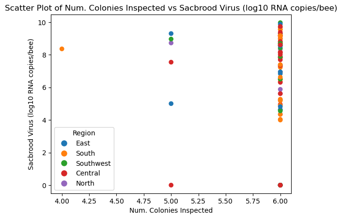
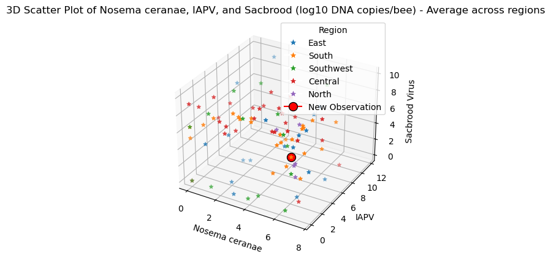

# Data Visualization

## Assignment 3: Final Project

### Requirements:
- We will finish this class by giving you the chance to use what you have learned in a practical context, by creating data visualizations from raw data. 
- Choose a dataset of interest from the [City of Toronto’s Open Data Portal](https://www.toronto.ca/city-government/data-research-maps/open-data/) or [Ontario’s Open Data Catalogue](https://data.ontario.ca/). 
- Using Python and one other data visualization software (Excel or free alternative, Tableau Public, any other tool you prefer), create two distinct visualizations from your dataset of choice.  
- For each visualization, describe and justify: 

- 

The following answer consider both visualizations: 

> What software did you use to create your data visualization?

Python ## Please see code attached in the file "Assignment_3_code.ipynb"

> Who is your intended audience? 

Governmental or private entities involved in apiculture, beekeeping, agribusiness, and food security. 

> What information or message are you trying to convey with your visualization? 

In visualization one, I aimed to represent the correlation between the number of colonies inspected and the presence of Sacbrood Virus across multiple regions in Ontario. In visualization two, I aimed to represent the correlation between the presence of three different viruses across regions. 

> What aspects of design did you consider when making your visualization? How did you apply them? With what elements of your plots? 

For both visualizations, I considered multiple aspects: 1. Labels: I added labels for the X and Y axes; 2. Colors: I color the datapoints representing different regions; 3. Title: I added a title to the scatter plot; 4. Legend: I added the regions legend; 5. "new observation", I wanted to highlight one observation in visualization two. 5. Data point size: I changed the size in visualization 2, so the new observation could be distinguished from the rest of the stars; 6. Shape: I plotted the data as stars and the new observation as a circle in visualization two. 

> How did you ensure that your data visualizations are reproducible? If the tool you used to make your data visualization is not reproducible, how will this impact your data visualization? 

For both visualizations, I generated reproducible code with comments on which users can find detailed steps on how to make the graphs. I also added a short paragraph at the beginning explaining the dataset. The data used to generate these plots is attached to this submission. Since I aimed to generate reproducible visualizations, I chose to make the plots in Python under any other software. 

> How did you ensure that your data visualization is accessible?

I am attaching the visualizations to this submission. The plots are also visible in the ipynb file attached to the submission.

## Visualization one

## Visualization two

> Who are the individuals and communities who might be impacted by your visualization?   

Ontario apiaries are among the most impacted businesses (e.g., grocery stores, local markets, agri-food systems, government or private initiatives fighting food insecurity) by the visualization. In visualization one, Sacbrood virus represents one of the major threats to honey production as multiple outbreaks can kill 90-100% of infected bee colonies (Wei et al., 2022). As the presence of this virus is abundant in more colonies inspected, entities should increase efforts in inspecting more colonies per locality to track potential outbreaks of this virus. In visualization two, I compared three different viruses across regions to assess for any patterns of viral infection occurrence across regions. In addition to the Sacbrood virus previously mentioned, I included the Israeli Acute Paralysis Virus (IAPV) and Nosema ceranae, a virus and a fungus, respectively, which also represent a serious threat to apiculture as their presence in bee colonies can cause colony collapse disorders, inducing the fast death of hives. Monitoring these viral infections is then critical for beekeepers and businesses that commercialize or use honey. Any community or individuals who consume honey or use honey as an add-on ingredient, especially in the South, Southwest, and Central regions, will be directly impacted by the presence of these viruses.  

Reference: Wei, R., Cao, L., Feng, Y., Chen, Y., Chen, G., & Zheng, H. (2022). Sacbrood Virus: A Growing Threat to Honeybees and Wild Pollinators. Viruses, 14(9), 1871. https://doi.org/10.3390/v14091871

> How did you choose which features of your chosen dataset to include or exclude from your visualization? 

In visualization one, I wanted to explore the dataset by assessing how the records of a single viral infection presence are impacted by the number of colonies screened in the survey. I selected the Sacbrood virus column, in addition to the "region" and "Num. colonies Inspected" columns. In visualization two, I selected the columns corresponding to the three pathogens -two viruses and one fungus of interest. 

> What ‘underwater labour’ contributed to your final data visualization product?

I wanted to represent the data in scatter plots, so I decided to build visualization one with two variables and the visualization two with three variables in a 3D format. 

- This assignment is intentionally open-ended - you are free to create static or dynamic data visualizations, maps, or whatever form of data visualization you think best communicates your information to your audience of choice! 
- Total word count should not exceed **(as a maximum) 1000 words** 

### Why am I doing this assignment?:  
- This ongoing assignment ensures active participation in the course, and assesses the learning outcomes: 
* Create and customize data visualizations from start to finish in Python
* Apply general design principles to create accessible and equitable data visualizations
* Use data visualization to tell a story  
- This would be a great project to include in your GitHub Portfolio – put in the effort to make it something worthy of showing prospective employers!

### Rubric:

| Component         | Scoring  | Requirement                                                                 |
|-------------------|----------|-----------------------------------------------------------------------------|
| Data Visualizations | Complete/Incomplete | - Data visualizations are distinct from each other - Data visualizations are clearly identified - Different sources/rationales (text with two images of data, if visualizations are labeled) - High-quality visuals (high resolution and clear data) - Data visualizations follow best practices of accessibility |
| Written Explanations | Complete/Incomplete | - All questions from assignment description are answered for each visualization - Explanations are supported by course content or scholarly sources, where needed |
| Code              | Complete/Incomplete | - All code is included as an appendix with your final submissions - Code is clearly commented and reproducible |

## Submission Information

🚨 **Please review our [Assignment Submission Guide](https://github.com/UofT-DSI/onboarding/blob/main/onboarding_documents/submissions.md)** 🚨 for detailed instructions on how to format, branch, and submit your work. Following these guidelines is crucial for your submissions to be evaluated correctly.

### Submission Parameters:
* Submission Due Date: `23:59 - 09/05/2025`
* The branch name for your repo should be: `assignment-3`
* What to submit for this assignment:
    * A folder/directory containing:
        * This file (assignment_3.md)
        * Two data visualizations 
        * Two markdown files for each both visualizations with their written descriptions.
        * Link to your dataset of choice.
        * Complete and commented code as an appendix (for your visualization made with Python, and for the other, if relevant) 
* What the pull request link should look like for this assignment: `https://github.com/<your_github_username>/visualization/pull/<pr_id>`
    * Open a private window in your browser. Copy and paste the link to your pull request into the address bar. Make sure you can see your pull request properly. This helps the technical facilitator and learning support staff review your submission easily.

Checklist:
- [ ] Create a branch called `assignment-3`.
- [ ] Ensure that the repository is public.
- [ ] Review [the PR description guidelines](https://github.com/UofT-DSI/onboarding/blob/main/onboarding_documents/submissions.md#guidelines-for-pull-request-descriptions) and adhere to them.
- [ ] Verify that the link is accessible in a private browser window.

If you encounter any difficulties or have questions, please don't hesitate to reach out to our team via our Slack. Our Technical Facilitators and Learning Support staff are here to help you navigate any challenges.
